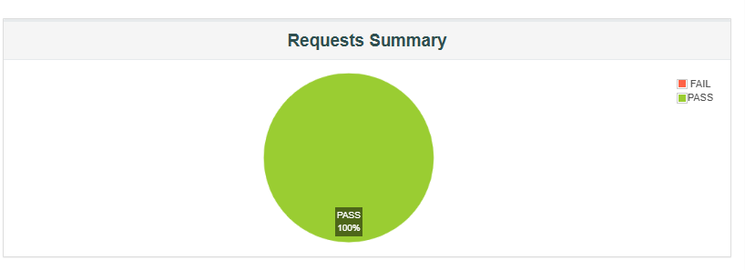
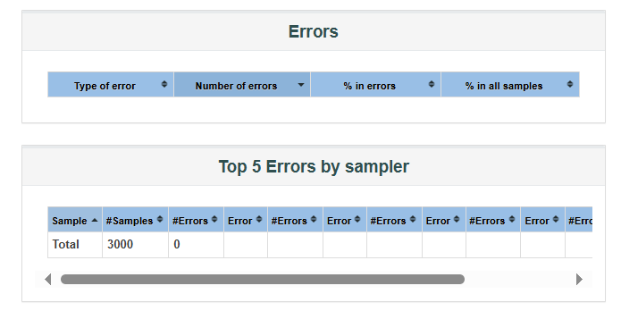

# Performance Testing on Booker API

## Overview

This document provides details on the performance testing conducted on the [Booker API](https://restful-booker.herokuapp.com/apidoc/index.html#api-Auth-CreateToken). The testing was performed using command-line tools with varying thread(concurrent user) counts to analyze system performance.

## Test Configuration

- **API Endpoint:** `/auth` (Create Token)
- **Testing Tool:** Command-line performance testing tool (e.g., Apache JMeter)
- **Loop Count:** 1
- **Metrics Captured:** Average Transactions Per Second (TPS), Error Rate

## Test Plan

Testplan > Add > Threads (Users) > Thread Group (this might vary dependent on the jMeter version you are using)

- Number of Threads (users): 500, 1000, 1500, 2000
- Ramp-Up Period (in seconds): 10
- Loop Count: 1  

# Test execution (from the Terminal)
 
- JMeter should be initialized in non-GUI mode.
- Make a report folder in the **bin** folder.  
- Run Command in __jmeter\bin__ folder.

## List of API 
- auth
- createBooking
- getBookingByID
- updateBooking
- UpdateByPatch
- deleteBooking

### Make jtl file

```bash
  jmeter -n -t  Performance_Testing_t500.jmx -l report\Performance_Testing_t500.jtl
```  

### Make html file 
  ```bash
  jmeter -g report\Performance_Testing_t500.jtl -o report\Performance_Testing_t500.html
```
 

## Results

The following table presents the results of the performance tests:

| Concurrent Users | Loop Count | Avg TPS | Error Rate (%) | Total Concurrent Users |
| ---------------- | ---------- | ------- | -------------- | ---------------------- |
| 500              | 1          | 50      | 0.00           | 3000                   |
| 1000             | 1          | 99      | 0.00           | 6000                   |
| 1500             | 1          | 148     | 0.00           | 9000                   |
| 2000             | 1          | 198     | 0.07           | 12000                  |

## Observations

- The API performs well under 500 concurrent users, with an average TPS of 50 and a minimal error rate.
- As the number of concurrent users increases, the TPS gradually decreases, and the error rate rises.
- At 2000 concurrent users, a significant drop in TPS (198) and a higher error rate (0.7%) indicate potential system bottlenecks.


## Conclusion

The Booker API handled up to 1500+ concurrent users efficiently but exhibited performance degradation beyond that threshold. Further optimizations in server scalability and request handling may be needed for improved high-load performance.

Requests Summary             |  Errors
:-------------------------:|:-------------------------:


**Number of Threads 500 ; Ramp-Up Period 10s**
   

**Number of Threads 1000 ; Ramp-Up Period 10s**


**Number of Threads 1500 ; Ramp-Up Period 10s**
 


**Number of Threads 2000 ; Ramp-Up Period 10s**


---

